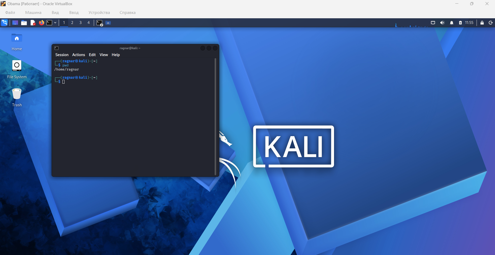
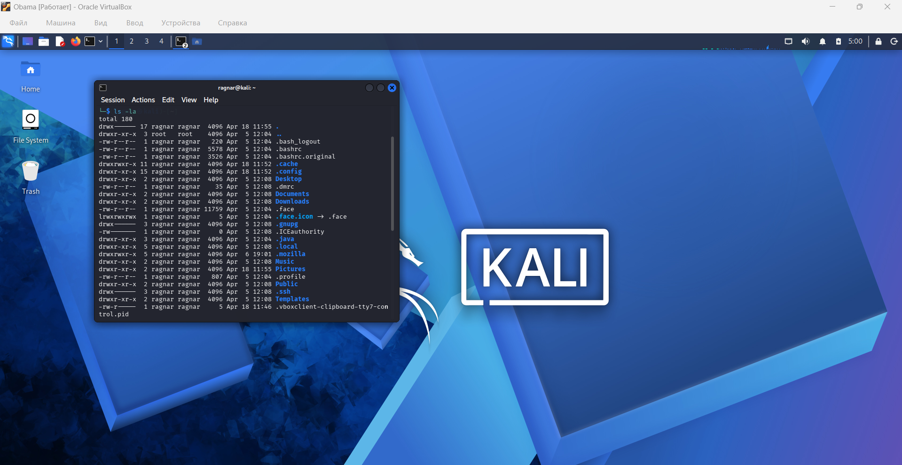
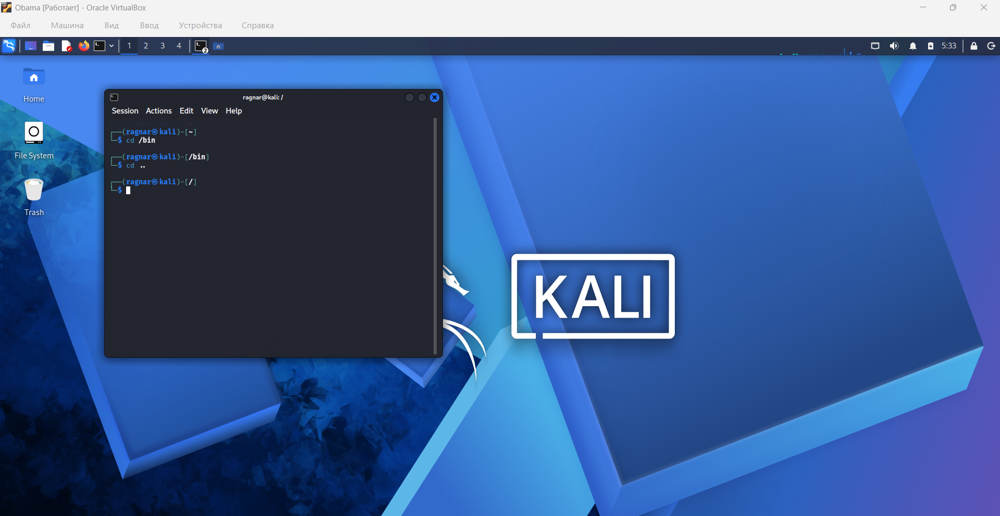

# Linux Basic Commands
## Navigation 

**Author:** ApostolR1 
**Date:** 2026-04-19

---

## 1. pwd

### Description
The `pwd` command *shows* the current directory

### Command
```bash
pwd

```


## 2. ls

### Description 
The `ls` command *displays* a list of folders and files

### Command 
```bash
ls

```


## 3. ls -la

### Description
The `ls -la` command *displays* deteiled list of files and permissions

### Command 
```bash
ls -la 

```


## 4. cd /dir

### Description 
The `cd /dir` command is needed to *navigate* to the desire directory

### Command
```bash
cd /

```


## 5. cd ..

### Description 
The `cd ..` command is need to go to *higher level directory*

### Command
```bash
cd ..

```


## 6. cd ~

### Description 
The `cd ~` command goes to the *home directory* 

### Command
```bash
cd ~

```
